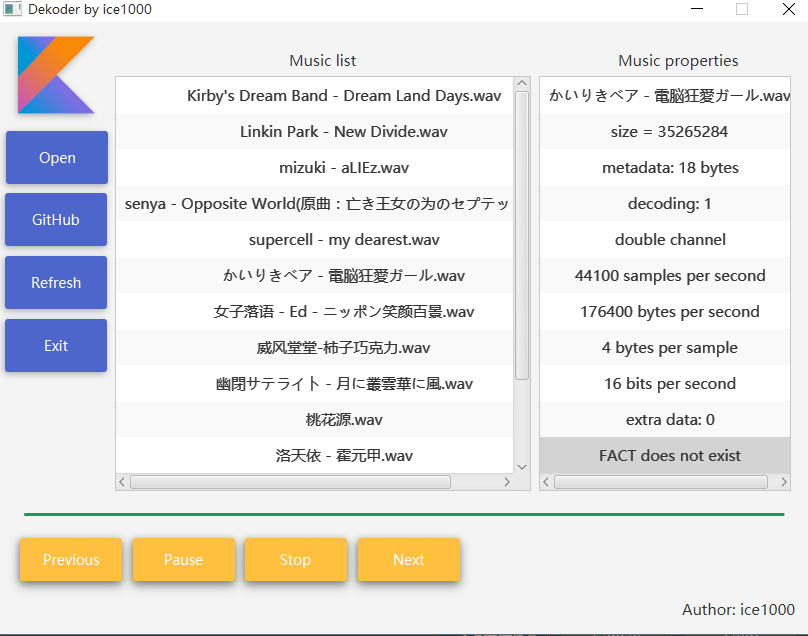

# Dekoder

### 这是什么
这是一个音乐播放器。 
使用Material Design的规范进行UI设计，使用纯Kotlin实现，不过GUI使用JavaFX。 
可以在[白俄罗斯的awesome-kotlin](https://github.com/KotlinBy/awesome-kotlin)和
[中国的awesome-kotlin](https://github.com/KotlinCN/awesome-kotlin)里面看到本项目英俊的身影。

### 语言
+ [English](./README.md)

### 进度
+ [X] 读取元数据
+ [X] GUI
+ [X] 播放与停止
+ [X] 进度条
+ [X] 暂停
+ [X] 播放列表
+ [X] 刷新列表
+ [X] 上一首、下一首
+ [ ] 列表循环
+ [ ] 识别音频
+ [ ] 用于音频格式的DSL

### 用到的开源项目
+ [JFoenix](https://github.com/jfoenixadmin/JFoenix)

### 支持的格式
+ *.wav

### 说明
一个Kotlin音乐播放器。使用纯Kotlin实现，不过和JavaFX的GUI接口是Java写的。 
基于JavaSound实现音乐播放功能。 

### 运行
将[这个jar包](out/artifacts/dekoder/dekoder.jar)拷贝至lib目录下即可运行。

### 版本
+ [v0.1 预览版](https://github.com/ice1000/Dekoder/releases/tag/v0.1)
是最早的版本，也是最简陋的版本。
+ [v1.0 稳定版](https://github.com/ice1000/Dekoder/releases/tag/v1.0)
是最早发布的稳定版，支持wav格式的音频播放，列出音乐，以及播放暂停功能。
+ [v1.1 稳定版](https://github.com/ice1000/Dekoder/releases/tag/v1.1)
实现了上一首、下一首、刷新列表功能。
+ [v1.2 稳定版](https://github.com/ice1000/Dekoder/releases/tag/v1.2)
新增退出按钮，可以安全退出（退出时杀死播放进程），修复大量历史遗留bug。