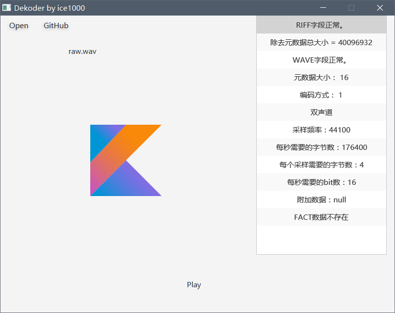

# Dekoder

### 这是什么
这是一个音乐播放器。 
使用Material Design。

### 语言
+ [English](./README.md)

### 进度
+ [X] 读取元数据
+ [X] GUI
+ [X] 播放音频
+ [ ] 识别音频

### 说明
有两个artifact，一个是纯Kotlin的CUI版，一个是基于JavaFX的GUI版。 
这也是我仍然在此项目中使用Java的原因。 
GUI比较强大，选择文件打开即可。
