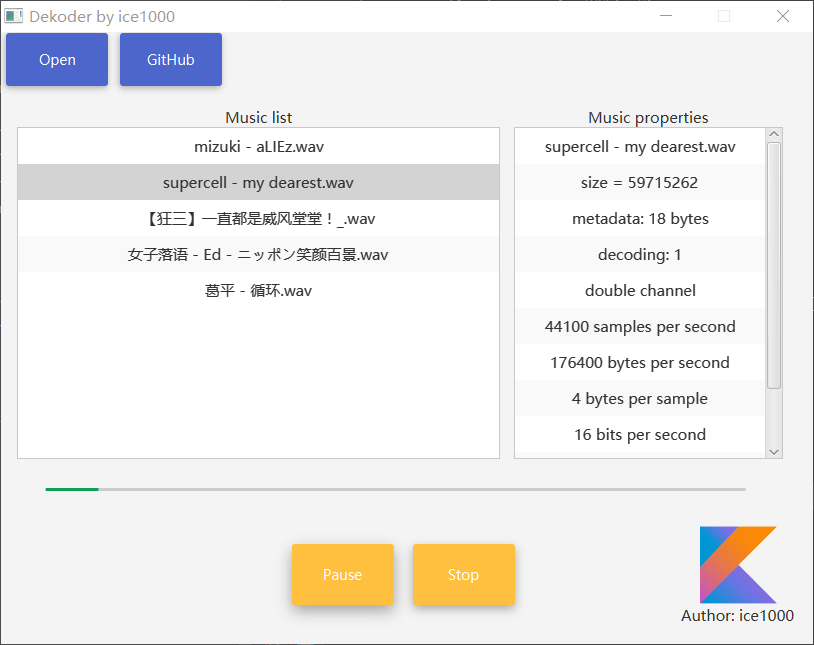

# Dekoder

### What this is
This is a cross-platform music player. 
Materially Designed, and written in pure kotlin but with a javaFX GUI.

### Language
+ [简体中文](./README-ZH.md)

### TODO list
+ [X] Read mata data.
+ [X] GUI
+ [X] Play and stop the media.
+ [X] Progress bar
+ [X] Pause
+ [ ] Play list
+ [ ] Read the wave
+ [ ] Media format DSL

### Supported formats
+ *.wav

### used open source projects
+ [JFoenix](https://github.com/jfoenixadmin/JFoenix)

### Description
A kotlin music player. 
Dekoder is a desktop music player powered by JavaSound. 
Written in pure Kotlin but with a JavaFX GUI interface written in Java. 

### build
Copy [this jar](out/artifact/dekoder/dekoder.jar) to the lib directory, and you can run it.