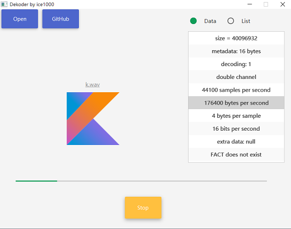

# Dekoder

### What this is
This is a cross-platform music player. 
Materially Designed, and written in pure kotlin but with a javaFX GUI.

### Language
+ [简体中文](./README-ZH.md)

### TODO list
+ [X] Read mata data.
+ [X] GUI
+ [X] Play and stop the media.
+ [X] Progress bar
+ [ ] Pause
+ [ ] Read the wave
+ [ ] Media format DSL

### Supported formats
+ *.wav

### used open source projects
+ [JFoenix](https://github.com/jfoenixadmin/JFoenix)

### Description
This project involves two artifacts. 
One is CUI edition, the other is with a GUI, and the GUI is based on JavaFX. 
And that`s why I still use Java in this Kotlin project, but java is just a UI interface in this project. 
The one with GUI is stronger, you only have to choose a file to open, and you can play it.